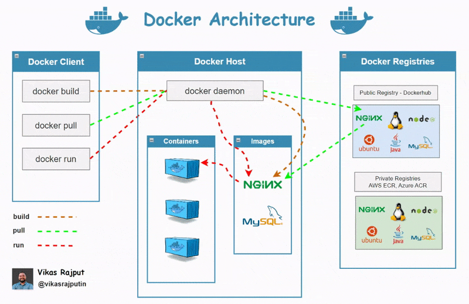

# Docker Architecture Simplified: [link](https://www.linkedin.com/posts/vikasrajputin_docker-architecture-simplified-docker-activity-7111937191097831424-LdAx/?utm_source=share&utm_medium=member_desktop)

✅ Docker Client: The starting point. When you use commands like docker run or docker build, you're talking to the Docker client.

✅ Docker Host: Contains the Docker Daemon which does all the heavy lifting (building, running containers, etc.). When you execute a command on the client, it’s the daemon that processes it.

✅ Docker Registry: Think of this as the library. It's where Docker images live. Docker Hub is a popular public registry, but there are private ones too.

✅ The Flow:

docker build: You're asking the client to tell the Docker Daemon to create an image based on your instructions (usually a Dockerfile). This image resides on the Docker Host.

docker pull: Fetches an image from a registry and saves it to the Docker Host.

docker run: This tells the Docker Daemon to create a container from an image.

In essence, when you 'pull', the client requests the Docker Daemon to fetch an image from the registry. And when you 'run', the Daemon uses that image to create and run a container.

