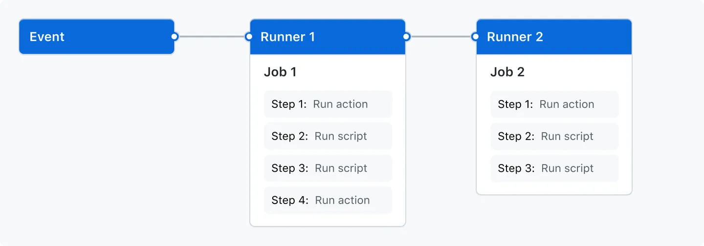

# [Automate your workflow from idea to production](https://github.com/features/actions)

GitHub `Actions` makes it easy to automate all your software `workflows`, now with world-class `CI/CD`. `Build`, `test`, and `deploy` your code right from `GitHub`. Make code `reviews`, `branch management`, and issue triaging work the way you want.

## Run a workflow on any GitHub event

Kick off workflows with GitHub events like

- push,
- issue creation,
- new release.


## Build , Test, and Publish


### Linux, macOS, Windows, ARM, and containers

`runs-on: self-hosted`

### Matrix builds

```
strategy:
      matrix:
        node-version: [14.x, 16.x, 18.x]
```

### Any language

GitHub Actions supports `Node.js`, `Python`, `Java`, `Ruby`, `PHP`, `Go`, `Rust`, `.NET`, and more. Build, test, and deploy applications in your language of choice.


### Live logs

See your workflow run in realtime with color and emoji. It’s one click to copy a link that highlights a specific line number to share a `CI/CD` failure.

### Built in secret store

Automate your software development practices with workflow files embracing the Git flow by codifying it in your repository.


### Multi-container testing
Test your web `service` and its `DB` in your workflow by simply adding some `docker-compose` to your workflow file.


## GitHub Actions documentation

`Automate`, `customize`, and execute your software development workflows right in your repository with GitHub Actions. You can `discover`, `create`, and `share` actions to perform any job you'd like, including `CI/CD`, and combine actions in a completely customized workflow.


### [Guides for GitHub Actions](https://docs.github.com/en/actions/guides)

These guides for GitHub Actions include specific use cases and examples to help you configure workflows.

#### [GitHub Actions learning paths](https://docs.github.com/en/actions/guides#learning-paths)

Learning paths are a collection of guides that help you master a particular subject.


##### [Get started with GitHub Actions](https://docs.github.com/en/actions/guides#get-started-with-github-actions-1) is 1 of 6 in learning path

Discover the possibilities of GitHub Actions by creating your first workflow

1. Overview: [Understanding GitHub Actions](https://docs.github.com/en/actions/learn-github-actions/understanding-github-actions?learn=getting_started&learnProduct=actions)

 ###### Understanding GitHub Actions

GitHub Actions is a continuous integration and continuous delivery (CI/CD) platform that allows you to automate your build, test, and deployment pipeline. You can create workflows that build and test every pull request to your repository, or deploy merged pull requests to production.

- The components of GitHub Actions

You can configure a GitHub Actions workflow to be triggered when an event occurs in your repository, such as a pull request being opened or an issue being created.



- Workflows: A workflow is a configurable automated process that will run one or more jobs. Workflows are defined by a `YAML` file checked in to your repository and will run when `triggered` by an `event` in your `repository`, or they can be triggered `manually`, or at a defined `schedule`.

Workflows are defined in the .github/workflows directory in a repository, and a repository can have multiple workflows, each of which can perform a different set of tasks.

Workflows are defined in the `.github/workflows` directory in a `repository`, and a repository can have `multiple` workflows, each of which can `perform` a `different set of tasks`.

For example, you can have one workflow to 

- build and test pull requests, 
- another workflow to deploy your application every time a release is created,
-  and still another workflow that adds a label every time someone opens a new issue.


- Events: 

An event is a specific activity in a repository that triggers a workflow run. For example, activity can originate from GitHub when someone creates a pull request, opens an issue, or pushes a commit to a repository. 
```
on:
  push:
    branches: [ "main" ]
```


- Jobs: 

A job is a set of `steps` in a `workflow` that is executed on the same runner.
Each step is either a shell script that will be executed, or an action that will be run. 

```
jobs:
  build:
   ........
```

- Actions:

An action is a custom application for the GitHub Actions platform that performs a complex but frequently repeated task. Use an action to help reduce the amount of repetitive code that you write in your workflow files. An action can pull your git repository from GitHub, set up the correct toolchain for your build environment, or set up the authentication to your cloud provider.

You can write your own actions, or you can find actions to use in your workflows in the GitHub Marketplace.


- Runners: 

A runner is a `server` that runs your workflows when they're triggered. Each runner can run a `single` `job` at a time. GitHub provides `Ubuntu Linux`, `Microsoft Windows`, and `macOS` runners to run your workflows; each workflow run executes in a fresh, newly-provisioned virtual machine.

2. How-to guide: Finding and customizing actions
3. Overview: Essential features of GitHub Actions
4. Overview: About workflows
5. How-to guide: Reusing workflows
6. Overview: Security hardening for GitHub Actions

##### Create an action


##### Host your own runners